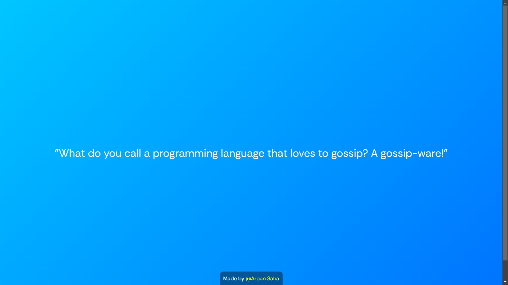

# NotAnotherJokeWeb 😂

A simple web application that generates random programming jokes to bring a smile to developers' faces. Perfect for a quick laugh during those long coding sessions! 💻✨

## Table of Contents

- [Demo](#demo) 📽️
- [Features](#features) 🌟
- [Installation](#installation) ⚙️
- [Usage](#usage) 📖
- [Contributing](#contributing) 🤝
- [License](#license) 📜

## Demo

 

## Features

- Randomly displays programming-related jokes 🤖
- Easy-to-use interface with a clean design 🖌️
- Simple JavaScript functionality to control joke display 🛠️

## Installation

To get started with the Jokes Generator, follow these steps:

1. Clone the repository:
   ```bash
   git clone https://github.com/Arpan-Saha-25/NotAnotherJokeWeb
   ```
2. Open the index.html file in your favorite web browser. 🌐

## Usage

Once you open the application, a joke will be displayed automatically. 🎉

After 2 seconds, you'll be prompted to see another joke. ⏳

Click "OK" to get a new joke or "Cancel" to stop. ❌

## Contributing

Contributions are welcome! If you'd like to contribute, please fork the repository and submit a pull request. You can help by:

##### Adding more jokes 🤣, Improving the styling 🎨, Enhancing functionality 🚀

### Made by @Arpan Saha 👋
